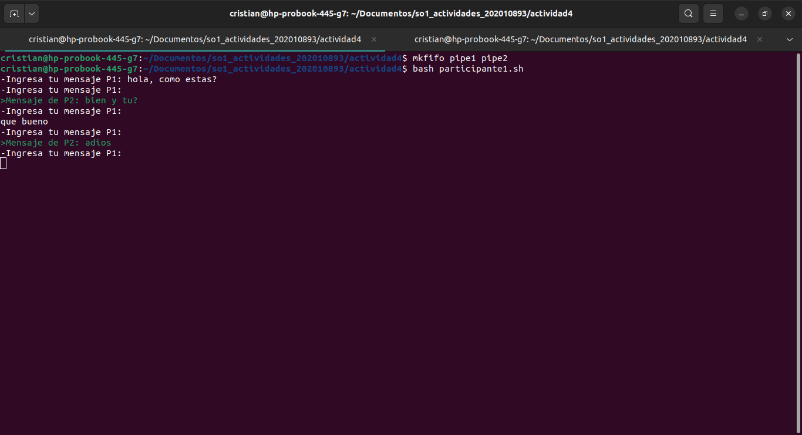
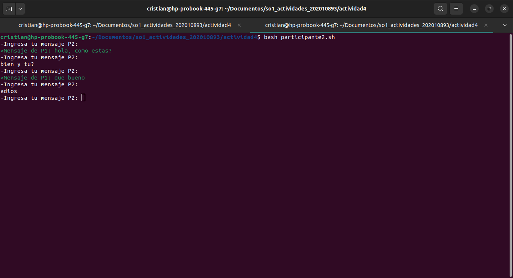

## Crear los Named Pipes

Siempre se deberán crear los siguientes pipes antes de ejecutar los scripts para cada participante de la conversación. El siguiente comando creará los pipes:
```bash
mkfifo pipe1 pipe2
```

## Crear el Script *`participante1.sh`*
Se deberá crear el script para el Participante 1 con el siguiente contenido:
```bash
#!/bin/bash

pipe_p1="pipe1"
pipe_p2="pipe2"
verde='\033[0;32m'
reset='\033[0m'

# Función para limpiar los pipes al finalizar
cleanup() {
    rm -f "$pipe_p1" "$pipe_p2"
    exit 0
}

trap cleanup EXIT # Se ejecuta la función cleanup al finalizar el script

# Subproceso para la lectura del participante 1
(while true; do
    if read -r mensaje < "$pipe_p1"; then
        echo ""
        echo -e "$verde>Mensaje de P2: $mensaje"
        echo -e "$reset-Ingresa tu mensaje P1: "
    fi
done) &

# Bucle principal para enviar mensajes al participante 2
while true; do
    read -p "-Ingresa tu mensaje P1: " mensaje
    echo "$mensaje" > "$pipe_p2"
done

```

Se definen dos variables, *"verde"* y *"reset"*, que contienen códigos de escape ANSI para establecer el color de la salida en verde y restablecer el color predeterminado, respectivamente. Estos códigos se utilizan más adelante para resaltar los mensajes en la salida.

Se define una función llamada *"cleanup"* que se ejecutará al finalizar el script. Esta función se encarga de eliminar los Named Pipes *"pipe1"* y *"pipe2"* utilizando el comando *"rm -f"*.

Se utiliza el comando *"trap"* para asociar la función *"cleanup"* al evento *"EXIT"*, lo que significa que la función se ejecutará automáticamente cuando el script finalice.

Este script realiza dos procesos: uno para el envío del mensaje al Participante 2, mediante la lectura constante de una entrada por teclado y mandando el mensaje al pipe2, y otro para la recepción y lectura del mensaje enviado por el Participante 2, mediante la lectura constante del pipe1. Cuando se reciba un nuevo mensaje este se mostrará de color verde en la pantalla para diferenciarlo mejor.

## Crear el Script *`participante2.sh`*
Se deberá crear el script para el Participante 2 con el siguiente contenido:
```bash
#!/bin/bash

pipe_p1="pipe1"
pipe_p2="pipe2"
verde='\033[0;32m'
reset='\033[0m'

# Función para limpiar los pipes al finalizar
cleanup() {
    rm -f "$pipe_p1" "$pipe_p2"
    exit 0
}

trap cleanup EXIT # Se ejecuta la función cleanup al finalizar el script

# Subproceso para la lectura del participante 2
(while true; do
    if read -r mensaje < "$pipe_p2"; then
        echo ""
        echo -e "$verde>Mensaje de P1: $mensaje"
        echo -e "$reset-Ingresa tu mensaje P2: "
    fi
done) &

# Bucle principal para enviar mensajes al participante 1
while true; do
    read -p "-Ingresa tu mensaje P2: " mensaje
    echo "$mensaje" > "$pipe_p1"
done

```

Se definen dos variables, *"verde"* y *"reset"*, que contienen códigos de escape ANSI para establecer el color de la salida en verde y restablecer el color predeterminado, respectivamente. Estos códigos se utilizan más adelante para resaltar los mensajes en la salida.

Se define una función llamada *"cleanup"* que se ejecutará al finalizar el script. Esta función se encarga de eliminar los Named Pipes *"pipe1"* y *"pipe2"* utilizando el comando *"rm -f"*.

Se utiliza el comando *"trap"* para asociar la función *"cleanup"* al evento *"EXIT"*, lo que significa que la función se ejecutará automáticamente cuando el script finalice.

Este script realiza dos procesos: uno para el envío del mensaje al Participante 1, mediante la lectura constante de una entrada por teclado y mandando el mensaje al pipe2, y otro para la recepción y lectura del mensaje enviado por el Participante 1, mediante la lectura constante del pipe2. Cuando se reciba un nuevo mensaje este se mostrará de color verde en la pantalla para diferenciarlo mejor.

## Ejecutar los Scripts

Se deberá ejecutar cada uno de los script anteriormente mencionados cada uno en una terminal diferente. Para ejecutarlos se puede utilizar el siguiente comando:
```bash
bash participante1.sh
```

```bash
bash participante2.sh
```

### Capturas de pantalla de la ejecución
#### Participante 1

#### Particpante 2
