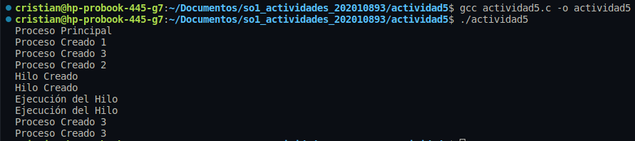

### Código
```c
#include <stdio.h>
#include <stdlib.h>
#include <unistd.h>
#include <pthread.h>

void *thread_function(void *arg) {
    printf("Ejecución del Hilo\n");
    pthread_exit(0);
}

int main() {
    pid_t pid;
    pthread_t tid;
    printf("Proceso Principal\n");
    printf("Proceso Creado 1\n");
    pid = fork(); //FORK1: Se crea un proceso hijo (Hijo 1)

    if (pid == 0) { // Proceso Hijo 1
        printf("Proceso Creado 2\n");
        fork(); // FORK2: Se crea otro proceso hijo (Hijo 2)
        printf("Hilo Creado\n");
        pthread_create(&tid, NULL, thread_function, NULL);
    }

    printf("Proceso Creado 3\n");
    fork(); // FORK3: Se crea otro proceso hijo
    
    return 0;
}
```

### Ejecución y Salida


### Preguntas
- a)¿Cuántos procesos únicos son creados?
Se crean 5 procesos (hijos) únicos, sin contar el proceso pincipal (padre) creado al momento de ejecutar el programa. A continuación se explica en que momento se crea cada uno.
- 1. **Hijo 1.** Se crea en el primer *fork()*, identificado como "FORK1" en los comentarios.
- 2. **Hijo 2.** Se crea en el segundo *fork()* dentro del *if*, identificado como "FORK2" en los comentarios, este solo se llama 1 vez debido a que se encuentra dentro del if, por lo que solo lo ejecuta el proceso **Hijo 1**.
- 3. En el último *fork()*, identificado como "FORK3" en los comentarios, se crean 3 procesos hijos debido a que la función se llama 3 veces. 
    - **Hijo 3.** Creado por el proceso padre.
    - **Hijo 4.** Creado por el proceso **Hijo 1**.
    - **Hijo 5.** Creado por el proceso **Hijo 2**.

- b)¿Cuántos hilos únicos son creados?
Se crean 2 hilos únicos debido a que cuando se crea el hilo es ejecutado por el proceso **Hijo 1** e **Hijo 2**.